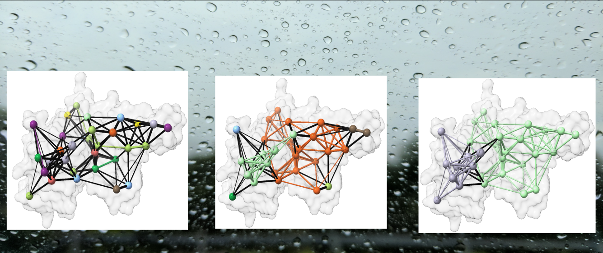

[](https://github.com/salilab/raindrops/actions?query=workflow%3Abuild)
[](https://codecov.io/gh/salilab/raindrops)



# RAInDrOPS : **R**igid-body **A**ssignment in **In**tegrative **D**ete**R**mination **O**f  **P**rotein **S**tructure

This module implements the RAInDrOPS algorithm for segmenting protein complexes optimally into rigid bodies, based on experimental distance and/or contact data, prior to structural sampling. Currently, only chemical crosslinks are utilized to dissect complexes into rigid bodies for integrative modeling, but other distance data can be easily incorporated. The rigid body definitions are presented as a text file in a format nearly similar to [PMI topology files](https://integrativemodeling.org/2.16.0/doc/ref/classIMP_1_1pmi_1_1topology_1_1TopologyReader.html),  which can be manually edited to easily construct more complex topologies.

Note, this module is *not* Python-2 compatible.

<br>

## Dependencies

RAInDrOPS represents protein complexes as undirected graphs, and so makes heavy use of [```networkx```](https://networkx.org/) and the [```Bio.PDB```](https://biopython.org/wiki/The_Biopython_Structural_Bioinformatics_FAQ) library from Biopython. The [```dill```](https://pypi.org/project/dill/) package is used for serializing graph structures for I/O.

<br>

## Information

_Author(s)_: Tanmoy Sanyal

_Maintainer_: `tanmoy7989`

_License_: [LGPL](https://www.gnu.org/licenses/old-licenses/lgpl-2.1.html)
This library is free software; you can redistribute it and/or
modify it under the terms of the GNU Lesser General Public
License as published by the Free Software Foundation; either
version 2 of the License, or (at your option) any later version.

_Publications_:  None yet.
